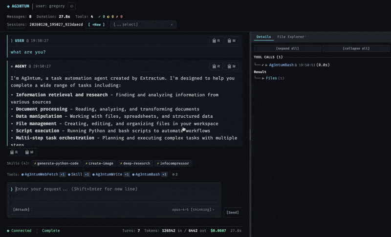

# Ag3ntum

**Claude Code for your servers. Secure. Multi-user. Under your control.**

<p align="center">
  
  
  
</p>

Ag3ntum transforms Claude Code into a **self-hosted AI automation platform** that's actually safe to run on production servers. Deploy on your infrastructure, access via web browser, and let your team automate server management, document processing, and business workflows—without sending data to external clouds.

> **Enterprise AI capabilities. Startup economics.**
> Pay only for Anthropic API usage—no platform fees, no per-seat licensing.



---

## Why Ag3ntum?

**Claude Code is powerful, but risky on servers.** It runs unsandboxed with full filesystem access—one wrong command and your production environment is compromised.

**Ag3ntum makes it safe.** Six layers of defense-in-depth including Bubblewrap sandboxing, OS-enforced user isolation, 140+ command filters, and automatic secrets scanning mean you can deploy AI automation alongside production systems without fear.

| Without Ag3ntum | With Ag3ntum |
|-----------------|--------------|
| Full filesystem access | Workspace-restricted |
| No command filtering | 140+ dangerous patterns blocked |
| Secrets exposed in environment | Sandboxed per-user secrets |
| Secrets visible in file previews | Auto-redacted API keys and tokens |
| All users share same UID | OS-enforced user isolation (UID 50000-60000) |
| Files can be accidentally deleted | Read-only mounts + overwrite protection |
| CLI-only access | Web UI + REST API |
| Single user | Multi-tenant with isolation |
| Black box execution | Full transparency—drill into every action |

---

## Core Capabilities

### Sandboxed Server Execution
Every shell command runs inside Bubblewrap sandbox with UID/GID isolation. Process namespace isolation, filtered `/proc`, clearenv with explicit allowlists, seccomp profiles blocking privilege escalation. Safe to colocate with production.

### Visual File Workflow
Side-by-side chat and file explorer. Drag files from your PC, watch the agent create outputs in real-time, click to preview, download results. No CLI knowledge required.

```
┌────────────────────────────────┬─────────────────────────┐
│      CONVERSATION              │    FILE EXPLORER        │
│                                │                         │
│  "Analyze the uploaded logs"   │  workspace/             │
│                                │  ├── app.log            │
│  [Tool: Ag3ntumRead ✓]         │  ├── report.md    ←NEW  │
│                                │  └── data/              │
│  "Found 12 errors..."          │                         │
│                                │  [Drag files to upload] │
└────────────────────────────────┴─────────────────────────┘
```

### Multi-Format Document Processing
Not just code files—process business documents:
- **PDF** with auto-OCR for scanned pages
- **Office** (DOCX, XLSX, PPTX)
- **Archives** (ZIP, TAR, 7z) with security scanning
- **Tabular data** (CSV, Excel, Parquet)

### Remote API Control
Full REST API with real-time Server-Sent Events. Build dashboards, integrate with CI/CD, trigger from webhooks, monitor from anywhere.

```bash
# Start a task
curl -X POST /sessions/run -d '{"prompt": "Analyze server logs"}'

# Stream events in real-time
curl /sessions/{id}/events  # SSE stream

# Human-in-the-loop approval
curl -X POST /sessions/{id}/answer -d '{"answer": "approved"}'
```

### Complete Execution Transparency
Drill down into every tool call, command, and subagent. See exact shell commands, exit codes, output files. Nothing hidden—full audit trail for compliance.

### Multi-Tenant Architecture with OS-Enforced Isolation
JWT authentication, isolated workspaces, per-user API keys, separated session history. Teams share one deployment while maintaining complete isolation.

**User-Level Isolation:** Each user runs under their own Linux UID (50000-60000 range). This is enforced by the kernel via seccomp profiles—not just prompts. Even if one user's sandbox is compromised, they cannot access another user's files or processes.

### True Read-Only File Access
Grant the agent read-only access to your files with **OS-level enforcement**. Docker `:ro` mounts and Bubblewrap `--ro-bind` ensure files cannot be modified—no matter what the agent attempts. Your source documents stay untouched while the agent analyzes them.

```
External Files (Protected)        Agent View
────────────────────────         ─────────────
/Users/greg/Documents/    ──►    workspace/external/ro/
  ├── contracts/                   ├── contracts/  [READ-ONLY]
  ├── financials/                  ├── financials/ [READ-ONLY]
  └── reports.xlsx                 └── reports.xlsx [READ-ONLY]
```

### Safe File Updates (Overwrite Protection)
Prevent accidental data loss with intelligent file update safeguards:
- **Auto-backup** before overwriting existing files
- **Confirmation prompts** for high-risk modifications
- **Clear tool semantics**: `Write` creates new, `Edit` modifies existing
- **Audit trail** for all file changes with before/after states

---

## Use Cases

| Scenario | What Ag3ntum Does |
|----------|-------------------|
| **VPS Administration** | Automated log analysis, config management, security audits—sandboxed |
| **Document Processing** | Extract data from invoices, analyze reports, transform spreadsheets |
| **Business Automation** | API integrations, data pipelines, report generation |
| **DevOps Workflows** | CI/CD assistance, infrastructure analysis, automated troubleshooting |

---

## Security Architecture

```
User Request
     │
     ▼
┌─────────────────────────────────┐
│  Layer 0: Inbound WAF           │  ← Request size limits, DoS prevention
├─────────────────────────────────┤
│  Layer 1: Docker Container      │  ← Host boundary
├─────────────────────────────────┤
│  Layer 2: Bubblewrap + UID      │  ← Process isolation + user isolation
├─────────────────────────────────┤
│  Layer 3: Ag3ntum Tools         │  ← PathValidator for file operations
├─────────────────────────────────┤
│  Layer 4: Command Filter        │  ← 140+ pattern blocks
├─────────────────────────────────┤
│  Layer 5: Security Middleware   │  ← HTTP headers, CSP, secrets scanning
├─────────────────────────────────┤
│  Layer 6: Prompts               │  ← Agent behavioral guidance
└─────────────────────────────────┘
     │
     ▼
  Safe Execution
```

Each layer operates independently. Even if one is bypassed, others contain the damage.

**UID/GID Isolation:** Each user runs under their own UID (50000-60000 range). This is OS-enforced via seccomp profiles—root access is **impossible**, not just discouraged.

**Automatic Secrets Scanning:** File Explorer automatically redacts API keys, tokens, and passwords before display. Same-length replacement preserves formatting while protecting credentials.

**Blocked by default:** `rm -rf`, `sudo`, `chmod 777`, `docker exec`, `nsenter`, path traversal, environment leakage, `/proc` enumeration, and 130+ more patterns.

### Why Ag3ntum Sandboxed > Claude Code Dockerized

| Protection | What It Prevents |
|------------|------------------|
| **OS-enforced user isolation** | Each user runs under unique UID; kernel blocks cross-user access |
| **Root access impossible** | Seccomp profiles block setuid to root at kernel level |
| **Invisible execution** | Agents see zero other processes, preventing reconnaissance attacks |
| **Escape-proof** | Container detection blocked; agents can't identify they're sandboxed |
| **Credential lockdown** | No sudo access, login history, or system user enumeration |
| **Secrets auto-redaction** | API keys hidden in file previews before user sees them |
| **Injection-resistant** | No writable PATH directories eliminates binary hijacking |
| **Ephemeral by design** | Clean tmpfs root with no Docker fingerprints |

*Verified via comparative security audits: 6-layer defense-in-depth with UID isolation reduces attack surface by 50%+ compared to plain Docker containers.*

---

## Quick Start

See **[QUICK-START-GUIDE.md](QUICK-START-GUIDE.md)** for complete VPS deployment instructions.

```bash
# Clone and configure
git clone https://github.com/extractumio/ag3ntum.git
cd ag3ntum

# Add your Anthropic API key
cp config/secrets.yaml.template config/secrets.yaml
# Edit config/secrets.yaml with your key

# Build and deploy
./run.sh rebuild --no-cache

# Create admin user
./run.sh create-user --username=admin --email=admin@example.com --password=YOUR_PASSWORD --admin

# Access Web UI at http://localhost:50080
```

---

## License

**Dual-licensed:**

- **AGPL-3.0** — Open source projects and personal use
- **Commercial License** — Proprietary applications, SaaS, enterprise

**Contact:** [info@extractum.io](mailto:info@extractum.io)

---

<p align="center">
  <strong>Claude Code can run on a server. Ag3ntum makes it safe—with 6 layers of defense and OS-enforced user isolation.</strong>
</p>