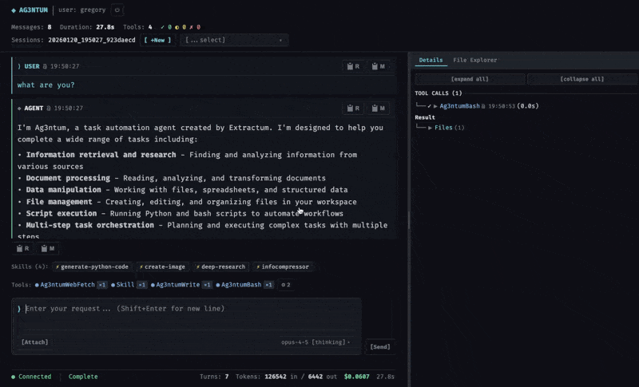

# Ag3ntum

**Server-safe Claude Code. Sandboxed. Multi-tenant. Self-hosted.**

<p align="center">
  
  
  
</p>

Ag3ntum is a **secure-by-default, multi-user Claude Code deployment** for production servers. It wraps every agent action in 6 layers of defense-in-depth—Bubblewrap sandboxing, OS-enforced user isolation, command filtering, and automatic secrets redaction—so you can run AI automation alongside production workloads without risk.

## Install

```bash
curl -fsSL https://raw.githubusercontent.com/extractumio/ag3ntum/main/install.sh | bash
```

Then open **http://localhost:50080** | See [QUICK-START-GUIDE.md](QUICK-START-GUIDE.md) for API key setup and user creation.

---

## Why Ag3ntum over Claude Code?

Claude Code is powerful but runs unsandboxed with full filesystem access. One wrong command can compromise your server.

| Production Risk | Claude Code | Ag3ntum |
|-----------------|-------------|---------|
| **SSH key theft** (`~/.ssh/id_rsa`) | Full access | Not mounted in sandbox |
| **AWS credential access** (`~/.aws/credentials`) | Full access | Not mounted |
| **Cloud metadata (169.254.169.254)** | IAM keys exposed | Blocked |
| **Environment variable dump** (`env`, `/proc/*/environ`) | All secrets visible | clearenv + filtered /proc |
| **Cross-user file access** | Single UID, shared access | Per-user UID isolation (50000-60000) |
| **Process enumeration** (`ps aux`) | All processes visible | Filtered /proc (only self) |
| **Privilege escalation** (`sudo`, setuid) | Possible if configured | Seccomp blocks at kernel level |
| **Persistence** (cron, authorized_keys, bashrc) | Full write access | Paths not mounted |
| **Dangerous commands** (`rm -rf /`, `dd`, fork bombs) | No filtering | 140+ patterns blocked |
| **Secrets in file previews** | Visible to user | Auto-redacted before display |
| **Container escape** (docker socket, nsenter) | If socket mounted | Command filter blocks |
| **Audit trail** | None | Full execution transparency |

---

## Key Features

### 6-Layer Security Architecture

```
Request → WAF → Docker → Bubblewrap+UID → PathValidator → CommandFilter → SecureOutput
```

Each layer operates independently. Even if one is bypassed, others contain the breach.

- **Bubblewrap sandbox** — Process namespace isolation, filtered `/proc`, seccomp profiles
- **UID isolation** — Each user gets unique Linux UID; kernel enforces separation
- **Command filtering** — 140+ patterns block `rm -rf`, `sudo`, `chmod 777`, `docker exec`, path traversal
- **Secrets scanning** — API keys and tokens auto-redacted in file previews

### Multi-Tenant Architecture

- JWT authentication with isolated workspaces
- Per-user API keys (sandboxed, not visible to other users)
- Separate session history and file storage
- Teams share one deployment with complete isolation

### Web UI + REST API

- Visual file explorer with drag-and-drop upload
- Real-time SSE event streaming
- Human-in-the-loop approval for sensitive operations
- Full audit trail—drill into every tool call, command, and exit code

### Document Processing

PDF (with OCR), Office (DOCX/XLSX/PPTX), archives (ZIP/TAR/7z), and tabular data (CSV/Excel/Parquet).

### Read-Only External Mounts

Grant agents read-only access to host files via OS-enforced `:ro` mounts. Source documents stay untouched.

---

## Use Cases

| Scenario | Capability |
|----------|------------|
| **Server Administration** | Log analysis, config management, security audits—sandboxed |
| **Document Processing** | Invoice extraction, report analysis, spreadsheet transformation |
| **Business Automation** | API integrations, data pipelines, scheduled workflows |
| **DevOps** | CI/CD assistance, infrastructure analysis, automated troubleshooting |

---

## Architecture



**Stack:** Python 3.13 + FastAPI + React 18 + SQLite + Redis

**Core SDK:** claude-agent-sdk with custom MCP tools (`mcp__ag3ntum__*`)

**Deployment:** Docker Compose with configurable external mounts

---

## License

- **AGPL-3.0** — Open source and personal use
- **Commercial License** — Proprietary applications, SaaS, enterprise

**Contact:** [info@extractum.io](mailto:info@extractum.io)

---

<p align="center">
  <strong>Run Claude Code on production servers. Ag3ntum makes it safe.</strong>
</p>